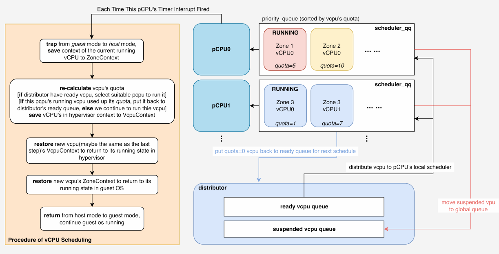

## 一, vm启动

``` rust
fn main {
    // ...
    hal::enable_virtualization();
    vmm::init();
    vmm::start();
}
```

vm的启动主要在这三个部分

1. enable_virtualization();在配置时钟, 以及cpu等硬件部分(hal.rs)

2. init();

   - 配置vm属性, 以及在它的内存空间导入os镜像

     ``` rust
     // image.rs
     /// Loads the VM image files.
     pub fn load_vm_images(config: AxVMCrateConfig, vm: VMRef) -> AxResult {...}
     ```

      加入GLOBAL_VM_LIST

     ``` rust
     // vm_list.rs
     pub fn push_vm(vm: VMRef) {
         GLOBAL_VM_LIST.lock().push_vm(vm.id(), vm)
     }
     ```

     

   - 在vcpu_list中选取0号为主vcpu, 为其配置初始task, 并将将vm_id - vm_vcpus存入VM_VCPU_TASK_WAIT_QUEUE

3. start()主要是boot 和 notify_primary_vcpu

``` rust
// vcpu.rs
pub struct VMVCpus {
    // The ID of the VM to which these VCpus belong.
    _vm_id: usize,
    // A wait queue to manage task scheduling for the VCpus.
    wait_queue: WaitQueue,
    // A list of tasks associated with the VCpus of this VM.
    vcpu_task_list: Vec<AxTaskRef>,
    /// The number of currently running or halting VCpus. 
    // ...
    running_halting_vcpu_count: AtomicUsize,
}
```

VMVCpus本身更像task的管理者, 最终vm的运行是vcpu_list中某个vcpu所管理的task

``` rust
fn unblock_one_task(task: AxTaskRef, resched: bool) {
    // Mark task as not in wait queue.
    task.set_in_wait_queue(false);
    // Select run queue by the CPU set of the task.
    // Use `NoOp` kernel guard here because the function is ..
    select_run_queue::<NoOp>(&task).unblock_task(task, resched)
}
```

- boot(标记vm为running后),vm并没有启动
- vcpus::notify_primary_vcpu(vm.id()); 将主vcpu的task(会配置初始task)放置在运行队列才会启动
- 这里有个选择pcpu的过程(select_run_queue)感觉和如图架构有些像



## 二,  

``` rust
// task.rs
def_task_ext!(TaskExt);
```

自动实现task_ext()` 和 `task_ext_mut() 来实现对附加字段的访问

``` rust
impl AxVMHal for AxVMHalImpl {
    type PagingHandler = axhal::paging::PagingHandlerImpl;

    fn alloc_memory_region_at(base: HostPhysAddr, size: usize) -> bool {...}
    fn dealloc_memory_region_at(base: HostPhysAddr, size: usize) {...}
    fn virt_to_phys(vaddr: HostVirtAddr) -> HostPhysAddr {...}
    fn current_time_nanos() -> u64 {...}
}
```

AxVMHal 与 PaginHandler的绑定

